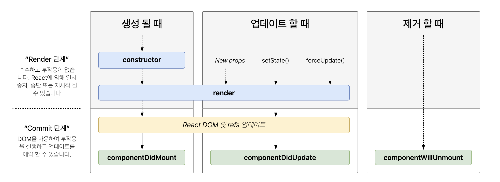

# 202130134 한경호

## 5/18 12주차

<br>

## 합성

* 합성은 여러 개의 컴포넌트를 합쳐서 새로운 컴포넌트를 만드는 것

* 조합 방법에 따라 합성의 사용 기법은 다음과 같이 나눌 수 있습니다

### Containment 
* 하위 컴포넌트를 포함하는 형태의 합성 방법

* 해당 컴포넌트를 사용하는 개발자가 어떤 것을 넣느냐에 따라 달라지기 때문에 보통 사이드바나 다이얼로그 같은 박스 형태의 컴포넌트는 자신의 하위 컴포넌트를 미리 알 수 없다. 따라서 Containment 방법을 사용하고 사용 방법은 리액트 컴포넌트의 props에 기본적으로 들어있는 children 속성을 사용하면 된다.

```js
function FancyBorder(props) {
    return (
        <div className={'FancyBorder FancyBorder-' + props.color}>
            {props.childern}
        </div>
    );
}
```
<br>

#### React.createElement : JSX를 사용하지 않고 리액트로 엘리먼트를 생성하는 방법

```js
// 리액트 기능을 사용한 방법
const reactElement = React.createElement(
    'h1', // tag
    {className: 'obj'}, // props
    'OBJ Element' // child element
)
```

<br>

#### 위의 FancyBorder 컴포넌트를 사용하는 예제

```js
function WelconmeDialog(props) {
    return (
        <FancyBorder color="blue">
            <h1 className="Dialog-title">
                어서오세요
            </h1>
             <p className="Dialog-message">            
                우리 사이트에 방문하신 것을 환영합니다!
            </p>
        </FancyBorder>
    );
}
```

* 위 코드에서는 WelcomeDialog 라는 컴포넌트가 나오고 여기에 FancyBorder 컴포넌트를 사용

* FancyBorder 컴포넌트로 감싸진 부분안에는 h1, p 태그가 들어가 있음

* 두 태그는 모두 FancyBorder 컴포넌트에 children 이라는 이름의 props로 전달

<br>

#### 여러개의 children 집합이 필요한 경우

* 별도로 props를 정의해서 각각 원하는 컴포넌트를 넣어준다.

```js
function spiltPane(props) {
    return (
    <div className="SplitPane">
        <div className="SplitPane-left">
            {props.left}
        </div>
        <div className="SplitPane-right">
            {props.right}
        </div>
    </div>
    );
}

function App(props) {
    return (
        <SplitPane
            left={
                <Contacts />
            }
            right={
                <Chat />
            }
        />
    );
}
```

* SplitPane은 화면을 왼쪽과 오른쪽으로 분할해서 보여주는 컴포넌트이다.

* 여기서 left, right라는 두 개의 props를 정의하여 그 안에 각각 다른 컴포넌트를 넣어줌

* SplitPane에서는 left, right를 props로 받고 각각의 화면의 왼쪽과 오른쪽을 분리해서 렌더링

* 이처럼 여러 개의 children 집합이 필요한 경우 별도의 props를 정의해 사용

<br>

### Specialization

* 범용적으로 쓸 수 있는 컴포넌트를 만들어 놓고 이를 특수화 시켜서 컴포넌트를 사용하는 방식

* 범용적인 개념을 구별이 되게 구체화하는 것을 Specialization(전문화, 특수화)라고 한다.

* 웰컴다이얼로그는 다이얼로그의 특별한 케이스이다.

* 객체지향 언어에서는 상속을 사용하여 특수화를 구현한다.

* 리액트에서는 합성을 사용하여 특수화를 구현한다.

```js
function Dialog(props) {
    return (
        <FancyBorder color="blue">
            <h1 className="Dialog-title">
                {props.title}
            </h1>
            <p className="Dialog-message">
                {props.message}
            </p>            
        </FancyBorder>
    );
}

function WelconmeDialog(props) {
    return (
        <Dialog
            title="어서오세요"
            message="우리 사이트에 방문하신 것을 환영합니다!"
            />
    );
}
```

* 먼저 Dialog 라는 범용적인 의미를 가진 컴포넌트가 나온 후 이 Dialog 컴포넌트를 사용하는 WelcomeDialog 컴포넌트가 나옴

* Dialog 컴포넌트는 title과 message라는 두 props를 갖고 있는데 각각 다이얼로그에 나오는 제목과 메세지를 의미

* WelcomeDialog 컴포넌트에서는 제목을 '어서오세요' 라고 짓고 사이트에 접속한 사용자에게 인사말을 하는 다이얼로그를 만듬

<br>

### Containment와 Specialization을 같이 사용하기

* Containment를 위해서 props.children를 사용하고 Specialization을 위해 직접 정의한 props를 사용

```js
function Dialog(props) {
    return (
        <FancyBorder color="blue">
            <h1 className="Dialog-title">
                {props.title}
            </h1>
            <p className="Dialog-message">
                {props.message}
            </p>
            <props.children>
        </FancyBorder>
    );
}

function SignUpDialog(props) {
    const [nickname, setNickname] = useState('');

    const handleChange = (event) => {
        setNickname(event.target.value);
    }

    const handleSignup = () => {
        alert(`어서 오세요, ${nuckname}님!`);
    }

    return (
        <Dialog
            title="화성 탐사 프로그램"
            message="닉네임을 입력해 주세요.">
            <input 
                value={nickname}
                onChange={handleChange} />
            <button onClick={handleSignUp}>
                가입하기
            </button>
        </Dialog>
    );
}
```
* Dialog 컴포넌트는 Containment를 위해 끝부분에 props.children를 추가했고 이를 통해 하위 컴포넌트가 다이얼로그 하단에 렌더링된다.

* Dialog 컴포넌트를 사용하는 SignUpDialog 컴포넌트를 살펴보면 Specialization을 위한 props인 title, message에 값을 넣어 주고 있으며 사용자로부터 닉네임을 입력받고 가입하도록 유도하는 input과 button 태그가 있다.

* 두 태그 모두 props.children 으로 전달되어 다이얼로그에 표시되고 이러한 형태로 Containment와 Specialization을 동시에 사용할 수 있다.

<br>

### 상속이란

* 합성과 대비되는 개념

* 자식 클래스는 부모 클래스가 가진 변수나 함수 등의 속성을 모두 갖게 되는 개념

* 리액트에서는 상속보다는 합성을 통해 새로운 컴포넌트를 생성

<br><br>

## 컨텍스트

* 기존의 일반적인 리액트에서는 데이터가 컴포넌트의 props를 통해 부모에서 지식으로 단방향으로 전달되었다

* 컨텍스트는 리액트 컴포넌트들 사이에서 데이터를 기존의 proprs를 통해 전달하는 당식 대신 '컴포넌트 트리를 통해 곧바로 컴포넌트에 전달하는 새로운 방식'을 제공한다.

* 이 것을 통해 어떤 컴포넌트라도 쉽게 데이터에 접근 가능

* 컨텍스트를 사용하면 일일이 props로 전달할 필요 없이 그림처럼 데이터를 필요로 하는 컴포넌트에 곧바로 데이터를 전달할 수 있다.

* props를 사용한 기존 방식 
* 

* 컨텍스트를 사용한 방식
* 

<br>

### 컨텍스트를 사용해야할 때

* 여러 컴포넌트에서 자주 필요로 하는 데이터는 로그인 여부, 로그인 정보, UI테마, 현재 선택된 언어 등이 있음

* 이러한 데이터들은 기존 방식대로 컴포넌트의 props를 통해 넘겨주게 되면 자식 컴포넌트의 자식 컴포넌트까지 계속해서 내려갈 수 밖에 없음

<br>

1. 현재 선택된 테마를 기존 방식대로 컴포넌트의 props로 전달하는 예제

```js
function App(props) {
    return <Toolbar theme="dark" />;
}

function Toolbar(props) {
    // 이 Toolbar 컴포넌트는 ThemedButton에 theme를 넘겨주기 위해서 'theme' prop을 가져야만 한다.
    // 현재 테마를 알아야 하는 모든 버튼에 대해서 props로 전달하는 것은 굉장히 비효율적이다.
    return (
        <div>
            <ThemeButton theme={props.theme} />
        </div>
    );
}

function ThemedButton(props) {
    return <Button theme={props.theme} />
}
```
* 위 코드에서는 총 3개의 컴포넌트를 사용하고 가장 상위 컴포넌트인 App 컴포넌트에서는 Toolbar 컴포넌트를 사용하고 있음

* 이때 theme라는 이름의 prop으로 현제 태마인 dark를 넘김

* Toolbar 컴포넌트에서는 ThemedButton 컴포넌트를 사용하는데 ThemedButton 컴포넌트에서 현재 테마를 필요로 하기 때문에 prop으로 받은 theme를 하위 컴포넌트인 ThemedButton 컴포넌트에 전달

* 최종적으로 ThemedButton 컴포넌트에서는 props.theme로 데이터에 접근해 버튼에 어두운 테마를 입힘

* 예제에서 처럼 props를 통해 데이터를 전달하는 기존 방식은 실제 데이터를 필요로 하는 컴포넌트까지의 깊이가 깊어질 수록 복잡해짐

* 또한 반복적인 코드를 계속해서 사용해 가독성이 떨어지며 비효율적임

<br>

2. 컨텍스트를 사용하여 위와 동일한 기능을 구현한 예제

```js
    // 컨텍스트는 데이터를 매번 컴포넌트를 통해 전달할 필요 없이 컴포넌트 트리로 곧바로 전달하게 해줌.
    // 여기에서는 현재 테마를 위한 컨텍스트를 생성하며, 기본값은 'light'이다.
    const ThemeContect = React.createContext('light');

    // Provider를 사용하여 하위 컴포넌트들에게 현재 테마 데이터를 전달.
    // 모든 하위 컴포넌트들은 컴포넌트 트리 하단에 얼마나 깊이 있는지에 관계없이 데이터를 읽을 수 있다.
    // 여기에서는 현재 테마값으로 'dark'를 전달하고 있다.
    function App(props) {
        return (
            <ThemeContext.Provider value="dark">
                <Toolbar />
            <ThemeContext.Provider>
        );
    }

    function Toolbar(props) {
         // 이제 중간에 위치한 컴포넌트는 테마 데이터를 하위 컴포넌트로 전달할 필요가 없다.
        return (
            <div>
                <ThemedButton />
            </div>
        );
    }

    function ThemedButton(props) {
        // 리액트는 가장 가까운 상위 테마 Provider를 찾아서 해당되는 값을 사용
        // 만약 해당되는 Provider가 없을 경우 기본값(여기에서는 'light')을 사용
        // 여기에서는 상위 Provider가 있기 때문에 현재 테마의 값은 'dark'가 된다.

        return (
            <ThemeContext.Consumer>
                {value => <Button theme={value} />}
            </ThemeContext.Consumer>
        );
    }
    
```

* 위 코드에서는 먼저 React.createContext() 함수를 사용해 ThemeContext라는 이름의 컨텍스트를 하나 생성

* 컨텍스트를 사용할 컴포넌트의 상위 컴포넌트에서 Provider로 감싸주어야 하는데 여기선 최상위 컴포넌트인 App 컴포넌트를 ThemeContext.Provider로 감싸줌

* 이렇게 하면 Provider의 모든 하위 컴포넌트가 얼마나 깊이 위치해 있는지 관계없이 컨텍스트의 데이터를 읽을 수 있음.

* 이처럼 여러 컴포넌트에서 계속 접은이 일어날 수 있는 데이터들이 있는 경우에 컨텍스트를 사용하는 것이 좋음

<br>

### 컨텍스트를 사용하기전 고려해야할 점

* 컨텍스트는 다른 레벨의 많은 컴포넌트가 특정 데이터를 필요로 하는 경우에 주로 사용

* 컴포넌트와 컨텍스트가 연동되면 재사용이 떨어지기 때문에 무조건 컨텍스트를 사용하는 것이 좋은 것은 아님

* 따라서 다른 레벨의 많은 컴포넌트가 에디터를 필요로 하는 경우가 아니면 props를 통해 데이터를 전달하는 컴포넌트 합성 방법이 더 적합하다.

```js
// Page 컴포넌트는 PageLayout 컴포넌트를 렌더링
<Page user={user} avatarSize={avatarSize} />

// PageLayout 컴포넌트는 NavigationBar 컴포넌트를 렌더링
<PageLayout user={user} avatarSize={avatarSize} />

// NavigationBar 컴포넌트는 Link 컴포넌트를 렌더링
<NavigationBar user={user} avatarSize={avatarSize} />

// Link 컴포넌트는 Avatar 컴포넌트를 렌더링
<Link href={user.permalink}>
    <Avatar user={user} size={avatarSize} />
</Link>
```
* 위의 코드는 사용자 정보와 아바타 사이즈를 몇 단계에 걸쳐서 하위 컴포넌트인 Link와 Avatar로 전달하는 Page 컴포넌트가 있다.

* 여기에서 가장 하위 레벨에 위치한 Avatar 컴포넌트가 user와 avatarSize를 필요로 하기 때문에, 이를 위해 여러 단계에 걸쳐서 props를 통해 user와 avatarSize를 전달해 주고 있다.

* 하지만 이 과정은 불필요한 부분이 많고 Avatar 컴포넌트에 추가적인 데이터가 필요해지면 해당 데이터도 추가로 여러 단계에 걸쳐서 넘겨주어야 하기 때문에 굉장히 번거로움

<br>

### 위의 문제를 해결하기 위한 방법

<br>

1. Avatar 컴포넌트를 변수에 저장하여 직접 넘겨주기

```js
function Page(props) {
    const user = props.user;

    const userLink = (
        <Link href={user.permalink}>
            <Avatar user={user} size={props.avatarSize}/>
        </Link>
    );

    // Page 컴포넌트는 PageLayout 컴포넌트를 렌더링
    // 이때 props로 userLink를 함께 전달
    return <PageLayout userLink={userLink} />;
}

// PageLayout 컴포넌트는 NavigationBar 컴포넌트를 렌더링
<PageLayout userLink={...} />

// NavigationBar 컴포넌트는 props로 전달받은 userLink element를 리턴
<NavigationBar userLink={...} />
```

* 위 코드에서는 user와 avatarSize가 props로 들어간 Avatar 컴포넌트를 userLink라는 변수에 저장한 뒤에 해당 변수를 하위 컴포넌트로 넘기고 있다.

* 이렇게 하면 가장 상위 레벨에 있는 Page 컴포넌트만 Avatar 컴포넌트에서 필요로 하는 user와 avatarSize에 대해 알고 있으면 됨

* 이런 방식은 중간 레벨의 컴포넌트를 통해 전달해야 하는 props를 없애고, 코드를 더욱 간결하게 만들어줌

* 다만 모든 상황에 이 방식이 좋은 것은 아니다. 데이터가 많아질수록 상위컴포넌트에 몰리기 때문에 상위 컴포넌트는 점점 더 복잡해지고, 하위 컴포넌트는 너무 유연해지게 되기 때문이다.

<br>

2. 하위 컴포넌트를 여러 개의 변수로 나누어 전달하기

```js
function Page(props) {
    const user = props.user;

    const topBar = (
        <NavigationBar>
            <Link href={user.permalink}>
                <Avatar user={user} size={props.avatarSize} />
            </Link>
        </NavigationBar> 
    );
    const content = <Feed user={user} />;

    return (
        <PageLayout
            topBar={topBar}
            content={content}
        />
    );
}
```

* 이 방식은 하위 컴포넌트의 의존성을 사우이 컴포넌트와 분리할 필요가 있는 대부분의 경우에 적합한 방법

* 또한 렌더링 전에 하위 컴포넌트가 상위 컴포넌트와 통신해야 하는 경우 render props를 사용하여 처리할 수도 있음

<br>

### 컨텍스트 API
<br>
1. React.createContext

* React.createContext() 함수를 이용해 컨텍스트를 생성하는 방법

```js
const MyContext = React.createContext(기본값);
```

* 리액트에서 렌더링이 일어날 때 컨텍스트 객체를 구독하는 하위 컴포넌트가 나오면 현재 컨텍스트의 값을 가장 가까이에 있는 상위 레벨의 Provider로부터 받아옴

* 그런데 만약 상위 레벨에 매칭되는 Provider가 없다면, 이경우에만 기본값이 사용됨

* 참고로 기본값으로 undefined를 넣으면 기본값이 사용되지 않음

<br>
2. Context.Provider

* Context.Provider 컴포넌트로 하위 컴포넌트들을 감싸주면 모든 하위 컴포넌트들이 해당 컨텍스트의 데이터에 접근할 수 있게 된다.

* Provider는 아래 코드처럼 사용 가능

```js 
<MyContext.Provider value={/* some value */}>
```

* Provider 컴포넌트에는 value라는 prop이 있으며, 이것은 Provider 컴포넌트 하위에 있는 컴포넌트들에게 전달됨

* 그리고 하위 컴포넌트들이 이 값을 사용하게 되는데 하위 컴포넌트가 데이터를 소비한다는 의미를 가지고 있어 consumer 컴포넌트라고 부름

<br>
3. Class.ContextType

* Class.contextType은 Provider 하위에 있는 클래스 컴포넌트에서 컨텍스트의 데이터에 접근하기 위해 사용하는 것

* MyClass.contextType = MyContext; 라고 해주면 MyClass 라는 클래스 컴포넌트는 MyContext의 데이터에 접근 가능

<br>
4. Context.Consumer

* 컨텍스트의 데이터를 구독하는 컴포넌트

```js
<MyContext.Consumer>
    {value => /* 컨텍스트의 값에 따라서 컴포넌트들을 렌더링 */}
<MyContext.Consumer>
```

* 컴포넌트의 자식으로 함수가 올 수 있는데 이것을 function as a child 라고 부름

<br>
5. ContextDisplayName

* 컨텍스트 객체는 displayName 이라는 문자열 속성을 가짐.

* 또한 크롬의 리액트 개발자 도구에서는 컨텍스트의 Provider나 Consumer를 표시할 때 이 displayName을 함께 표시해준다.

---

## 5/11 11주차

<br>

## 하위 컴포넌트에서 State 공유

<br>

1. 물의 끓음 여부를 알려주는 컴포넌트

    * 섭씨온도 값을 props로 받아서 물이 끓는지 안 끓는지를 문자열로 출력해 주는 컴포넌트
    ```js
        function BoilingVerdict(props) {
            if (props.celsius >= 100) {
                return <p>물이 끓습니다.</p>;
            }
            return <p>물이 끓지 않습니다.</p>;
        }
    ```

    * 위 컴포넌트를 실제로 사용하는 부모 컴포넌트, Calculator
    ```js
        function Calculator(props) {
            const [temperature, setTemperature] = useState('');

            const handleChange = (event) => {
                setTemperature(event.target.value);
            }
            
            return (
                <fieldset>
                    <legend>섭씨 온도를 입력하세요:</legend>
                    <input
                        value={temperature}
                        onChange={handleChange} />
                    <BoilingVerdict
                        celsius={parseFloat(temperature)} />
                </fieldset>
            )
        }
    ```
<br>

2. 입력 컴포넌트 추출하기

    * Calculator 컴포넌트 안에 온도를 입력하는 부분을 별도의 컴포넌트로 추출, 온도를 입력받기 위한 TemperatureInput 컴포넌트
    ```js
        const scaleNames = {
            c: '섭씨',
            f: '화씨'
        };
        function TemperatureInput(props) {
            const [temperature, setTemperature] = useState('');

            const handleChange = (event) => {
                setTemperature(event.target.value);
            }

            return (
                <fieldset>
                    <legend>온도를 입력해주세요(단위:{scaleNames[props.scale]}):</legend>
                    <input value = {temperature} onChange={handleChange} />
                </fieldset>
            )
        }
    ```

    * 추출한 컴포넌트를 사용하도록 Calculator 컴포넌트를 변경
    ```js
        function Calculator(props) {
            return (
                <div>
                    <TemperatureInut sclae="c" />
                    <TemperatureInut sclae="f" />
                </div>
            );
        }
    ```

 <br>

3. 온도 변환 함수 작성하기
    * 화씨온도를 섭씨온도로 변환하는 함수와 섭씨온도를 화씨온도로 변환하는 함수
    ```js
    function toCelsius(fahrenhiet) {
        return (fahrenheit - 32) * 5 / 9;
    }
    function toFahrenheit(celsius) {
        return (celsius * 9 / 5) + 32;
    }
    ```

    * 위의 함수를 호출하는 함수, tryConvert() 함수는 온도 값과 변환하는 함수를 피라미터로 받아서 값을 변환시켜 리턴해주는 함수
    ```js
    function tryConvert(temperature, convert) {
    const input = parseFloat(temperature);
    if (Number.isNaN(input)) {
        return "";
    }
    const output = convert(input);
    const rounded = Math.round(output * 1000) / 1000;
    return rounded.toString();
    }
    ```

<br>

4. Shared State 적용하기
    * 하위 컴포넌트의 state를 공통된 부모 컴포넌트로 올려서 shared state를 적용해야 함
    * 여기서 state를 상위 컴포넌트로 올린다는 것을 State 끌어올리기 라고 표현함
    * 이를 위해서는 먼저 TemperatureInput 컴포넌트에서 온도 값을 가져오는 부분을 수정해야함
    ```js 
        return (
            // 변경 전 : <input value={temperature} onChange={handleChange} />
            <input value={props.temperature} onChange={handleChange} />
        )
    ```

    * 컴포넌트의 state를 사용하지 않게 되기 때문에 입력값이 변경되었을 때 상위 컴포넌트로 변경된 값을 전달해주기 위해 handleChange() 함수를 변경
    ```js
    const handleChange = (event) => {
        // 변경 전 : setTemperature(event.target.value);
        props.onTemperatureChange(event.target.value);
    }
    ```

    * 최종적으로 완성된 TemperatureInput 컴포넌트
    ```js
    function TemperatureInput(props) {
        const handleChange = (event) => {
            props.onTemperatureChange(event.target.value);
        }


        return (
            <fieldset>
                <legend>온도를 입력해주세요(단위:{scaleNames[props.scale]}):</legend>
                <input value = {props.temperature} onChange={handleChange} />
            </fieldset>
        )
    }
    ```

<br>

5. Calculator 컴포넌트 변경하기

    * state로 temperature와 sclae을 선언하여 온도 값과 단위를 각각 저장하도록 함

    * TemperatureInput 컴포넌트를 사용하는 부분에서는 각 단위로 변환된 온도 값과 단위를 props로 넣어 주었고, 값이 변경되었을 때 업데이트하기 위한 함수를 onTemperatureChange에 넣어 주었음   
    ```js
    function Calculator(props) {
        const [temperature, setTemperature] = useState("");
        const [scale, setScale] = useState("c");

        const handleCelsiusChange = (temperature) => {
            setTemperature(temperature);
            setScale("c");
        };

        const handleFahrenheitChange = (temperature) => {
            setTemperature(temperature);
            setScale("f");
        };

        const celsius =
            scale === "f" ? tryConvert(temperature, toCelsius) : temperature;
        const fahrenheit =
            scale === "c" ? tryConvert(temperature, toFahrenheit) : temperature;

        return (
            <div>
                <TemperatureInput
                    scale="c"
                    temperature={celsius}
                    onTemperatureChange={handleCelsiusChange}
                />
                <TemperatureInput
                    scale="f"
                    temperature={fahrenheit}
                    onTemperatureChange={handleFahrenheitChange}
                />
                <BoilingVerdict celsius={parseFloat(celsius)} />
            </div>
        );
    }
    ```


---

## 5/04 10주차


## 리스트와 키

* 리스트는 자바스크립트의 변수나 객체를 하나의 변수로 묶어 놓은 배열

* 키는 각 객체나 아이템을 구분할 수 있는 고유한 값을 의미

* 리액트에서 배열과 키를 사용하며 반복되는 다수의 엘리먼트를 쉽게 렌더링 할 수 있음

* 여러개의 컴포넌트를 렌더링할 때는 map() 함수를 이용함

### map() 함수 예제

* map()을 이용하여 하나씩 추출하여, 2를 곱한 후 doubled라는 배열에 다시 넣는 코드

```js 
const doubled = numbers.map((number) => number * 2);
```

<br>

ex) 리액트에서 사용하는 경우

```js
const numbers = [1, 2, 3, 4, 5];
const listItems = numbers.map((number) => 
    <li>{number}</li>
);
```

위 코드는 numbers의 요소에 2를 곱하는 대신 li 태그를 결합해서 리턴하고 리턴된 listItems는 ul태그와 결합하여 렌더링 된다.

### 리액트에서의 리스트와 키

* 리스트에서의 키는 "리스트 에서 아이템을 구별하기 위한 고유한 문자열"

* 이 키는 리스트에서 어떤 아이템이 변경, 추가 또는 제거되었는지 구분하기 위해 사용

* 키는 같은 리스트에 있는 엘리먼트 사이에서만 고유한 값이면 됨

```js
const numbers = [1, 2, 3, 4, 5];
const listItems = numbers.map((number) =>
    <li key={number.toString()}>
        {number}
    </li>
);
```
ex) 키 값을 id로 사용하는 경우
```js
const todoItems = todos.map((todo) =>
    <li key={todo.id}>
        {todo.text}
    </li>
);
```

ex) 키 값으로 인덱스를 사용하는 방법

* 성능에 부정적인 영향을 끼칠 수 있고 컴포넌트의 state와 관련하여 문제를 일으킬 수 있기 때문에 배열에서 아이템의 순서가 바뀔 수 있는 경우에는 사용하는 것을 권장하지 않음

```js
const todoItems = todos.map((todo, index) =>
    // 아이템들의 고유한 ID가 없을 경우에만 사용해야 함
    <li key={index}>
        {todo.text}
    </li>
);
```

## 폼(Form)

* 폼은 일반적으로 사용자로부터 입력을 받기위한 양식에서 많이 사용

### 제어 컴포넌트 

* 사용자가 입력한 값에 접근하고 제어할 수 있도록 해주는 컴포넌트

* 아래 코드는 위에서 나왔던 사용자의 이름을 입력 받는 HTML 폼을 리액트의 제어 컴포넌트로 만든 것

```js
function NameForm(props) {
    const [value, setValue] = useState('');

    const handleChange = (event) => {
        setValue(event.target.value);
    }

    const handleChange = (event) => {
        alert('입력한 이름: ' + value);
        event.preventDefault();
}

    return (
        <form onSubmit={handleSubmit}>
            <label>
                이름:
                <input type="text" value={value} onChange={handleChange}>
            </label>
        <button type="submit">제출</button>
        </form>
    )
}
```
<br>

### textarea 태그

* html 에서는 textarea의 children으로 들어가는 형태이다

* 리액트에서는 state를 통해 태그의 value라는 attribute를 변경하여 텍스트를 표시

```js
function RequestForm(props) {
    const [value, setValue] = useState('요청사항을 입력하세요.');

    const handleChange = (event) => {
        setValue(event.target.value);
    }

    const handleChange = (event) => {
        alert('입력한 요청사항: ' + value);
        event.preventDefault();
}

    return (
        <form onSubmit={handleSubmit}>
            <label>
                요청사항:
                <input value={value} onChange={handleChange} />
            </label>
            <button type="submit">제출</button>
        </form>
    )
}
```
<br>

### select 태그

* 드록다운 목록을 보여주기 위한 HTML 태그

```js
function FruitSelect(props) {
    const [value, setValue] = useState('grape');

    const handleChange = (event) => {
        setValue(event.target.value);
    }

    const handleChange = (event) => {
        alert('선택한 과일: ' + value);
        event.preventDefault();
}

    return (
        <form onSubmit={handleSubmit}>
            <label>
                과일을 선택하세요:
                <select value={value} onChange={handleChange}>
                    <option value="apple">사과</option>
                    <option value="banana">바나나</option>
                    <option value="grape">포도</option>
                    <option value="watermelon">수박</option>
                </select>
            </label>
            <button type="submit">제출</button>
        </form>
    )
}
```

<br>

### File input 태그

* 디바이스의 저장 장치로부터 사용자가 하나 또는 여러 개의 파일을 선택할 수 있게 해주는 Html 태그
```js
<input type="file" />
```

<br>

### 여러 개의 입력을 다룰 때

* 여러 개의 입력을 다룰때는 여러 개의 state를 선언하여 각각의 입력에 대해 사용하면 됨

```js
function Reservation(props) {
    const [haveBreakfast, setHaveBreakfast] = useState('true');
    const [numberOfGuest, setNumberOfGuest] = useState(2);

    const handleChange = (event) => {
        alert(`아침식사 여부: ${haveBreakfast}, 방문객 수: ${numberOfGuest}`);
        event.preventDefault();
}

    return (
        <form onSubmit={handleSubmit}>
            <label>
                아침식사 여부:
                <input
                    type="checkbox"
                    checked={haveBreakfast}
                    onChange={(event) => {
                        setHaveBreakfast(event.target.changed);
                    }} />
            </label>
            <br />
            <label>
                방문객 수:
                <input
                    type="number"
                    value={numberOfGuest}
                    onChange={(event) => {
                        setNumberOfGuest(event.target.value);
                    }} />
            </label>
            <button type="submit">제출</button>
        </form>
    );
}
```

### Input Null Value

* 제어 컴포넌트에 value prop을 정해진 값으로 넣으면 코드를 수정하지 않는 한 입력값을 바꿀 수 없음

* 만약 value prop은 넣되 자유롭게 입력할 수 있게 만들고 싶다면 값이 undefined 또는 null을 넣어주면 됨

```js
ReactDom.render(<input value="hi" />, rootNode);

setTimeout(function() {
    ReactDOM.render(<input value={null} />, rootNode);
}, 1000);
```

## Shared State 

* 공유된 state이며 어떤 컴포넌트의 state에 있는 데이터를 여러 개의 하위 컴포넌트에서 공통적으로 사용하는 경우를 말함


---

## 4/27 9주차

## 이벤트 

* 사용자가 버튼을 클릭하는 등의 사건을 의미

### 이벤트 처리하기

* DOM의 이벤트
    * 이벤트의 이름을 모두 소문자로 표시 ex) onclick
    * 이벤트를 처리할 함수를 문자열로 전달

* 리액트의 이벤트
    * 이벤트의 이름을 카멜 표기법으로 표기 ex) onClick
    * 이벤트를 처리할 함수를 그대로 전달

* 이벤트 헨들러
    * 이벤트가 발생했을 때 해당 이벤트를 처리하는 함수

* jsx 에서 bind를 사용하는 이유는 기본적으로 클래스 함수들이 바운드 되지 않기 때문에 bind를 하지 않으면 this.handleClick은 글로벌 스코프에서 호출되는데 글로벌 스코프에서 thos.handleClick은 undefined이므로 사용할 수가 없다.

* 함수형 컴포넌트에서 이벤트 처리하기

```js 
// 방법 1. 함수 안에 함수로 정의
function handleClick() {
    setIsToggleOn((isToggleOn) => !isToggleOn);
}
// 방법 2. arrow function을 사용하여 정의
const handleClick = () => {
    setIsToggleOn((isToggleOn) => !isToggleOn);
}
```
<br>

## Arguments 전달하기

* 함수를 정의할 때는 피라미터 혹은 매개변수, 함수를 사용할 때는 아귀먼트 혹은 인자라고 부른다.

```js
<button onClick={(event) => this.deleteItem(id, event)}>삭제하기</button>
<button onClick={this.deleteItem.bind(this, id)}>삭제하기</button>
```

* 위 코드는 동일한 역할을 하지만 하나는 화살표 함수, 하나는 bind를 사용했고 두 방법 모두 첫 번째 매개변수는 id이고 두 번째 매개변수는 event가 전달됨

## 조건부 렌더링

* 어떠한 조건에 따라서 렌더링이 달라지는 것

```js 
function Greeting(props) {
    const isLoggedIn = props.isLoggenIn;
    if (isLoggedIn) {
        return <UserGreeting />
    }
    return <GuestGreeting />;
}
```
props로 전달 받은 isLoggedIn이 true이면 <UserGreeting />을, false면 <GuestGreeting />을 return 한다.

<br>

## 엘리먼트 변수 

* 렌더링해야 될 컴포넌트를 변수처럼 사용하는 방법이 엘리먼트 변수

```js
if (isLoggedIn) {
    button = <LogoutButton onClick={handleLogoutClick} />;
} else {
    button = <LoginButton onClick={handleLoginClick} />;
}

return (
    <div> 
        <Greeting isLoggedIn={isLoggedIn} />
        {button}
    </div>
)
```
<br>

## 인라인 조건

필요한 곳에 조건문을 직접 넣어 사용하는 방법

1. 인라인 IF
    * if문을 직접 사용하지 않고, 동일한 효과를 내기 위해 && 논리 연산자를 사용
    * &&는 and연산자로 모든 조건이 참일때만 참이 됨
    * 단축평가 : 첫번째 조건이 거짓이면 두번째 조건은 판단할 필요가 없음  

2. 인라인 If-Else
    * 삼항 연산자를 사용 ex) 조건문 ? 참 : 거짓
    * 문자열이나 엘리먼트를 넣어서 사용할 수도 있음

## 컴포넌트 렌더링 막기

컴포넌트를 렌더링 하고 싶지 않을 때에는 null을 리턴한다

```js
function WarningBanner(props) {
    if (!props.warning) {
        return null;
    }

    return (
        <div>경고!</div>
    );
}
```

---


## 4/13 7주차

## Hook

* Hook이란? 
    * 클래스형 컴포넌트에서는 생성자에서 state를 정의하고, setState() 함수를 통해 state를 업데이트한다
    
    * 예전에 사용하던 함수형 컴포넌트는 별도로 state를 정의하거나, 컴포넌트의 생명주기에 맞춰서 어떤 코드도 실행 불가했으나 함수형 컴포넌트에서도 state나 생명주기 함수의 기능을 사용하기 위해 추가된 기능이 바로 훅(Hook) 이다.

    * Hook : state와 생명주기 기능에 갈고리를 걸어 원하는 시점에 정해진 함수를 실행되도록 만든 함수

    * Hook의 이름은 모두 'use'로 시작

## useState 

* 함수형 컴포넌트에서 state를 사용하기 위한 Hook

* 사용법 : const [변수명, set함수명]  = useState(초깃값);
```js
    import React, {useState} from "react";

    function Counter(props) {
        const [count, setCount] = useState(0);

        return (
            <div>
                <p>총 {count}번 클릭했습니다. </p>
                <button onClick{() => setCount(count + 1)}>
                    클릭
                </button>
            </div>
        );
    }
```

<br>

## useEffect

* useState와 함께 가장 많이 사용하는 Hook

* 사이드 이펙트를 수행하기 위한 것

* 이 작업을 이펙트라고 부르는 이유는 이 작업들이 다른 컴포넌트에 영향을 미칠 수 있으며, 렌더링 중에는 작업이 완료될 수 없기 때문이다

* 렌더링이 끝난 이후에 실행되어야 하는 작업들

* 클래스 컴포넌트의 생명주기 함수와 같은 기능을 하나로 통합한 기능 제공

* 사용법 : useEffect(이펙트 함수, 의존성 배열);
    

```js
    import React, {useState, useEffect} from "react";

    function Counter(props) {
        const [count, setCount] = useState(0);

        useEffect(() => { 
            document.title = '총 ${count}번 클릭했습니다.';    
        })

        return (
            <div>
                <p>총 {count}번 클릭했습니다. </p>
                <button onClick{() => setCount(count + 1)}>
                    클릭
                </button>
            </div>
        );
    }
```

* 의존성 배열은 이펙트가 의존하고 있는 배열로, 배열 안에 있는 변수 중에 하나라도 값이 변경되었을 때 이펙트 함수가 실행된다

* 이펙트 함수는 처음 컴포넌트가 렌더링 된 이후, 그리고 재 렌더링 이후에 실행

* 만약 이펙트 함수가 마운트와 언마운트 될 때만 한번씩 실행되게 하고 싶으면 빈 배열을 넣으면된다

* useEffect()에서 리턴하는 함수는 컴포넌트가 마운트 해제될 때 호출된다

<br>

## useMemo

* useMemo() 훅은 Memoizde value를 리턴하는 훅

* 이전 계산값을 갖고 있기 때문에 연산량이 많은 작업의 반복을 피할 수 있다

* 이 훅은 렌더링이 일어나는 동안 실행된다

* 따라서 렌더링이 일어나는 동안 실행되어서는 안될 작업을 넣으면 안된다

```js
    const memoizedValue = useMemo(
        () => {
            return computeExpensiveValue(의존성 변수1. 의존성 변수2);
        },
        [의존성 변수1, 의존성 변수2]
    );
```

<br>

## useCallback 
* useCallback() 훅은 useMemo()와 유사한 역할

* 차이점은 값이 아닌 함수를 반환

* 의존성 배열을 피마리터로 받는 것은 useMemo 와 동일

* 피라미터로 받은 함수를 콜백이라 부름

* useMemo와 마찬가지로 의존성 배열 중 하나라도 변경되면 콜백함수를 반환

```js
    const memoizedValue = useCallback(
        () => {
            doSomething(의존성 변수1. 의존성 변수2);
        },
        [의존성 변수1, 의존성 변수2]
    );
```

<br>

## useRef

* useRef() 훅은 레퍼런스를 사용하기 위한 훅이다

* 레퍼런스란 특정 컴포넌트에 접근할 수 있는 객체를 의미

* useRef() 훅은 바로 이 레퍼런스 객체를 반환

* 레퍼런스 객체에는 .current라는 속성이 있는데, 이것은 현재 참조하고 있는 엘리먼트를 의미

```js
const refContainer = useRef(초깃값);
```

## 훅의 규칙

1. 무조건 최상위 레벨에서만 호출해야 한다는 것

    * 반복문이나 조건문 또는 중첩된 함수들 안에서 훅을 호출 불가

    * 컴포넌트가 렌더링 될때마다 같은 순서로 호출되어야 함

2. 리액트 함수 컴포넌트에서만 훅을 호출해야 함

    * 일반 자바스크립트 함수에서 훅을 호출하면 안됨

    * 훅은 리액트 함수 컴포넌트 or 직접 만든 커스텀 훅에서만 호출 가능


<br>

## 커스텀 훅

* 리액트에서 기본적으로 제공되는 훅을 이외에 추가적으로 필요한 기능이 있다면 직접 훅을 만들어서 사용할 수 있다

### 커스텀 훅 추출

* 두 개의 자바스크립트 함수에서 하나의 로직을 공유하도록 하고 싶을 때 새로운 함수를 하나 만드는 방법을 사용

* 리액트 컴포넌트와 훅은 모두 함수이기 때문에 동일한 방법을 사용할 수 있다

* 이름을 use로 시작하고, 내부에서 다른 훅을 호출하는 자바스크립트 함수를 만들면 됨

---

## 4/6 6주차

### 컴포넌트 추출

* 큰 컴포넌트에서 일부를 추출해서 새로운 컴포넌트를 만든다는 것
* 복잡한 컴포넌트를 쪼개서 여러 개의 컴포넌트로 나눌 수 도 있다
* Comment 컴포넌트가 UserInfo 컴포넌트를 포함하고 있고, UserInfo 컴포넌트가 Avatar 컴포넌트를 포함하고 있는 구조. 기능 단위로 구분하는 것이 좋고, 나중에 곧바로 재사용이 가능한 형태로 추출하는 것이 좋음

* 


## State

* State 의미 
    * State는 리액트 컴포넌트의 상태를 의미
    * 상태의 의미는 정상인지 비정상인지가 아닌 컴포넌트의 데이터를 의미
    * 정확히는 컴포넌트의 변경가능한 데이터를 의미
    * State가 변하면 다시 렌더링이 되기 때문에 렌더링과 관련된 값만 state에 포함시켜야 함

* State 특징
    * 리액트만의 특별한 형태가 아닌 JavaScript 객체임
    * 함수형에서는 userState()라는 함수 사용
    * state를 변경하고자 할때는 setState() 함수를 사용

## 생명주기

* 생명주기는 컴포넌트의 생성 시점, 사용 시점, 종료 시점을 나타내는 것
* constructor가 실행되면서 컴포넌트가 생성
* 컴포넌트가 소멸하기 전까지 여러번 렌더링함
* 렌더링은 props, setState(), forceUpdate() 에 의해 상태가 변경되면 이루어짐
* 컴포넌트 생성 - componentDidMount() - 렌더링 끝 - componentDidUpdate() - 컴포넌트 언마운트 - componentWillUnmount()


---

## 3/30 5주차

## Element
* Element의 정의
    * 리액트 앱을 구성하는 요소를 의미한다
    * 리액트 앱의 가장 작은 빌딩 블록들
* Element의 생김새
    * 리액트 엘리먼트는 자바스크립트 객체의 형태로 존재한다
    * 컴포넌트, 속성 및 내부의 모든 children을 포함하는 일반 js 객체이다
    * 이 객체는 마음대로 변경할 수 없는 불변성을 갖고 있다
    * 버튼을 나타내기 위한 Element ex)
    ```js
    {
        type : 'button',
        props : {
            className : 'bg-green' , 
            children : {
                type : 'b',
                props: {
                    children : 'Hello, element!'
                }
            }
        }
    }
    ```
* Element의 특징
    * 한 번 생성된 엘리먼트의 children이나 속성을 바꿀 수 없다
    * 화면에 변경된 엘리먼트들을 보여주기 위해선 새로운 엘리먼트를 만들어야한다
    * Virtual DOM 개념도
    

### 엘리먼트 렌더링

```js
<div id="root"></div> 
```
* 위 HTML 코드는 root 라는 id를 가진 div 태그이다
* 실제로 이 div 태그 안에 리액트 엘리먼트들이 렌더링되며, 이것을 Root DOM node라고 부른다

### 렌더링된 엘리먼트 업데이트하기

* 새로운 엘리먼트를 생성해서 바꿔치기하는 것

### 기본 CDN + 바벨 CDN 사용하기

* 아래 코드를 head태그 안에 작성
```html
<script crossorigin src="https://unpkg.com/react@18/umd/react.production.min.js"></script>
<script crossorigin src="https://unpkg.com/react-dom@18/umd/react-dom.production.min.js"></script>
<script src=" https://unpkg.com/@babel/standalone/babel.min.js"></script>
```
* 아래 코드를 body태그 안에 작성
```html
<script type="text/babel">
```

## 리액트 컴포넌트
* 리액트는 컴포넌트 기반의 구조와 같다
*  작은 컴포넌트들이 모여서 하나의 컴포넌트를 구성하고 이러한 컴포넌트들이 모여서 전체 페이지를 구성한 것

### PROPS
* props는 prop(property: 속성, 특성)의 줄임말
* 이 props가 컴포넌트의 속성이다
* 컴포넌트에 어떤 속성, props를 넣느냐에 따라 속성이 다른 엘리먼트가 출력
* props는 컴포넌트에 전달할 다양한 정보를 담고 있는 자바스크립트 객체이다
* props는 읽기 전용이며 변경할 수 없다

### PROPS 사용법
* JSX에서는 key-value쌍으로 props 구성
```js
function App() {
    return (
        <Profile
            name = "소플"
            introduction = "안녕하세요, 소플입니다."
            viewCount = {1500}
            />
    );
}
```
1. 위의 코드는 App 컴포넌트에서 props를 인자로 받음
2. 내부의 profile 컴포넌트로 전달해서 name, introduction. viewCount에 각각 세가지 속성을 넣음
3. 이렇게 하면 이 속성의 값이 모두 Profile 컴포넌트에 props로 전달되며 props는 아래와 같은 형태의 자바스크립트 객체가 됨

```js
{
    name = "소플"
    introduction = "안녕하세요, 소플입니다."
    viewCount = {1500}
}
```

### PURE 함수 / IMPURE 함수
* pure 함수는 인수로 받은 정보가 함수 내부에서도 변하지 않는 함수
* impure 함수는 인수로 받은 정보가 함수 내부에서 변하는 함수

### 컴포넌트 종류
* 함수형 컴포넌트
```js
function Welcome(props) {
    return <h1>안녕, {props.name}</h1>
}
```
* 클래스형 컴포넌트
```js
class Welcome extends React.Component {
    render() {
        return <h1>안녕, {this.props.name}</h1>;
    }
}
```
* 리액트 초기 버전을 사용할 때는 클래스형 컴포넌트를 주로 사용
* 이후 Hook이라는 개념이 나오면서 함수형 컴포넌트를 주로 사용

### 컴포넌트 합성
* 여러개의 컴포넌트를 합쳐서 하나의 컴포넌트를 만드는 것


---

## 3/23 4주차

## React 프로젝트 생성 및 깃 연동하기

1. React 프로젝트 생성하기
```
1. npx create-react-app 23-React1
2. npm start
```

2. Git 연동하기

```
1. git init
2. 본인의 깃허브 계정에 들어가서 연동할 repository 만들기
3. git remote add origin 만들어진 주소
```

3. 깃허브에 작성한 코드를 레퍼지토리에 푸쉬하면 완성


## JSX 

* 자바스크립트의 모든 기능이 포함된 자바스크립트의 확장 문법
* Javascript와 XML/HTML을 합친 것
```js
const name = 'Josh Perez';
const element = <h1>Hello, {name}</h1>;

```


### JSX의 역할

* JSX는 내부적으로 XML/HTML 코드를 자바스크립트로 변환한다.
* 이 역할을 하는 함수가 createElement()라는 함수이다.

### JSX의 장점

* 코드가 간결해진다.
* 가독성이 향상된다
* Injection Attack이라 불리는 해킹 방법을 방어함으로써 보안에 강하다

### JSX의 사용법

* 모든 자바스크립트 문법을 지원한다
* 자바스크립트 문법에 XML과 HTML을 섞어서 사용한다
---

## 3/16 3주차

## React 

* 사용자 인터페이스를 만들기 위한 자바스크립트 라이브러리
* 하나의 프로그램을 만드는 툴, 렌더링 툴
* 복잡한 사이트를 쉽고 빠르게 만들기 위한 툴

    ### React 장점

    1. 빠른 업데이트와 렌더링 속도
        * 빠른 업데이트를 위해 virtual DOM을 사용
    2. 컴포넌트 기반 구조
        * PascalCase : 앞에 문자부터 대문자 ex) UpperCase
        * CamelCase : 중간 문자부터 대문자 ex) upperCase
        * 에어비앤비 사이트 화면이 대표적인 컴포넌트 구조
    3. 재사용성
        * 반복적인 작업을 줄여주기 때문에 생산성을 높임
        * 유지보수 용이
        * 재사용이 가능 하려면 해당 모듈의 의존성이 없어야함
    4. 든든한 지원군
        * 메타(구 페이스북)에서 오픈소스 프로젝트로 관리하고 있어 계속 발전하고 있음
    5. 활발한 지식 공유 & 커뮤니티
    6. 모바일 앱 개발 가능
        * 리액트 네이티브라는 모바일 환경 UI프레임워크를 사용하면 크로스 플랫폼(cross-platform) 모바일앱을 개발할 수 있음
    
    ### React 단점 
    1. 방대한 학습량
        * 단 자바스크립트를 공부한경우 빠르게 습득가능
    2. 높은 상태 관리 복잡도

### 동기식/비동기식

* 동기식 : 요청과 그 결과가 동시에 일어난다는 약속

    * 장점 : 설계가 매우 간단하고 직관적임
    * 단점 : 결과가 주어질 때까지 아무것도 못하고 대기해야함

* 비동기식 : 동시에 일어나지 않는다는 의미 
    * 장점 : 결과가 주어지는데 시간이 걸리더라도 그 시간 동안에 다른 작업을 할 수 있으므로 자원들을 효율적으로 사용가능 
    * 단점 : 동기식보다 설계가 복잡함

* 동기식과 비동기식 차이의 기준 : 서버와 클라이언트가 같이 작동하는지가 기준


#### CDN 링크 
```js
<script crossorigin src="https://unpkg.com/react@18/umd/react.production.min.js"></script>


<script crossorigin src="https://unpkg.com/react-dom@18/umd/react-dom.production.min.js"></script>
```

### 리액트 적용하기
1. 새로운 폴더 생성하기
2. npx create-react-app my-app
3. npm start

---


## 3/9 2주차

## Html

* Single Page Application - 단일 페이지로 구성된 웹 어플리케이션

* HTML5test - 브라우저의 html 호환성 테스트를 검사할 수 있는 사이트

## JavaScript

* ES6 (ECMAScript6) 

* var 보단 const를 많이 사용

* component class형 component, 함수형 component - 함수형 component가 더 간결하고 class형 component에서 하는 걸 다 할 수 있기 때문에 요즘엔 함수형 component 사용 비율 증가

## JSON 스타일 

* key와 key value로 이루어져 있음

### 연산자 

* 대입 연산자, 산술 연산자, 대입+산술 연산자, 증감 연산자 (postfix방식 a++, prefix방식 ++a), 비교 연산자, 동등 연산자/일치 연산자, 이진 논리 연산자, 삼항 연산자

* '==='은 속성까지 따지는 비교 연산자 ex) 1 === '1' 은 false 

### 함수 

* Function statement 형 : 일반적 함수의 형태

* Arrow Function expression 형 : 화살표 함수
ex) const multiply = (a, b) => { return a+b }

---

